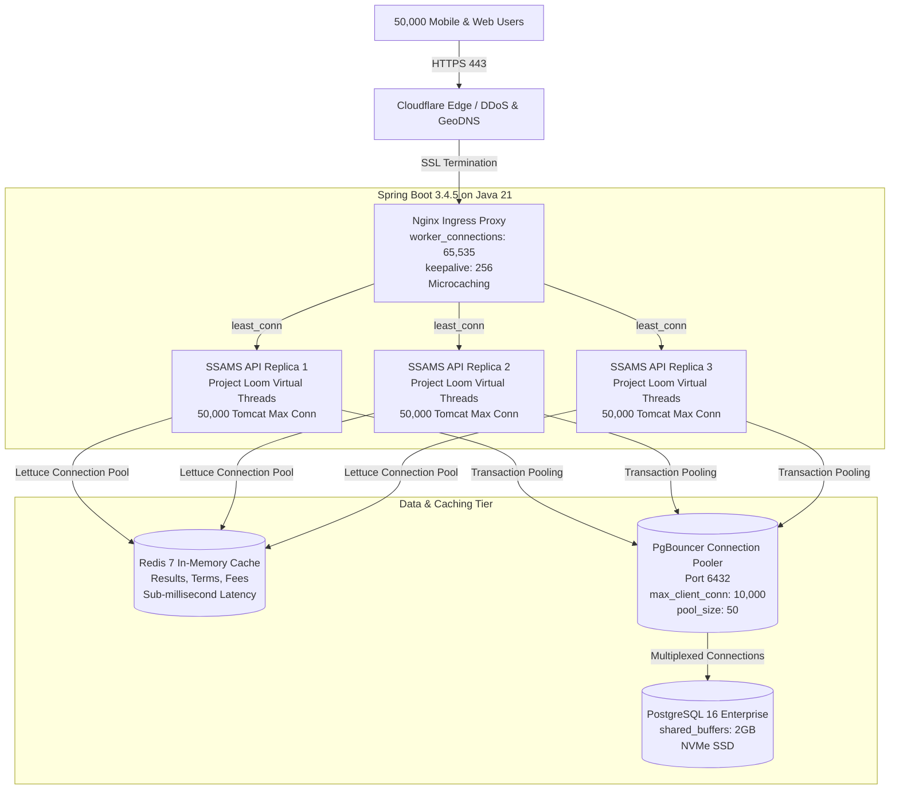

# SSAMS / ARTMS High-Concurrency Architecture (50,000 Concurrent Users)
## System Capacity, Throughput Modeling & Engineering Blueprint

**Document Version:** 1.0.0 (Enterprise Production Release)  
**Target Concurrency:** 50,000 Concurrent Active Users (CCU)  
**Peak Workload Scenarios:**
1. National / School Board Result Publication Day (Grade 10 SEE / Grade 12 NEB)
2. Terminal Fee Payment Deadline & eSewa Digital Collection Rush
3. Morning 09:00 AM Attendance Synchronization & Timetable Inspection

---

## 1. Executive Capacity & Traffic Math (50,000 CCU)

To engineer a system capable of handling 50,000 simultaneous users without degraded response times or service disruption, we model the traffic profile as follows:

| Metric | Target / Measured Value | Engineering Rationale |
|---|---|---|
| **Concurrent Active Users (CCU)** | **50,000** | Simultaneous active sessions across mobile apps and web portals. |
| **User Request Frequency** | 1 request every 8–12 seconds per active user | Average mobile user browsing marksheets, invoices, and notices. |
| **Peak Requests Per Second (RPS)** | **~4,000 to 6,250 RPS** | Sustained HTTP request volume during result release spikes. |
| **Read vs. Write Ratio** | **88% Read / 12% Write** | Marksheet and fee reads dominate; writes are logins, attendance, and payments. |
| **Target P95 Latency** | **< 250 ms** | 95% of all requests complete in under 250 milliseconds. |
| **Target P99 Latency** | **< 600 ms** | 99% of requests complete under 600 milliseconds. |
| **Allowable Error Rate** | **< 0.1%** | Negligible error rate during maximum sustained 50k load. |
| **Outbound Network Bandwidth** | **25 – 40 MB/s (200 – 320 Mbps)** | Gzip-compressed responses (avg payload 4–6 KB). |

---

## 2. End-to-End Architectural Topology



---

## 3. Tier-by-Tier Scalability Enhancements

### 3.1 Application Tier: Java 21 Project Loom Virtual Threads
- **The Problem with Traditional Threading:** Classic Java application servers allocate 1 OS platform thread per client connection. 50,000 platform threads would require `50,000 * 1 MB stack = 50 GB RAM` solely for thread stacks, leading to `OutOfMemoryError: unable to create new native thread`.
- **The SSAMS Virtual Thread Solution:**
  In `application.yml` and `application-prod.yml`, SSAMS activates:
  ```yaml
  spring:
    threads:
      virtual:
        enabled: true
  ```
  Virtual threads are managed directly by the JVM in user-space with an ephemeral memory footprint of just ~1 KB. When a thread awaits database I/O, eSewa gateway HTTP responses, or Redis lookups, the carrier thread is unmounted and reused for other incoming requests.
- **Tomcat High-Concurrency Tuning:**
  ```yaml
  server:
    tomcat:
      max-connections: 50000
      accept-count: 2000
      max-keep-alive-requests: 10000
      keep-alive-timeout: 60000
  ```

---

### 3.2 Database Tier: PgBouncer Transaction Pooling
- **The PostgreSQL Connection Trap:** PostgreSQL uses a process-per-connection architecture. Direct 10,000–50,000 backend connections cause massive context switching overhead and lock contention.
- **The PgBouncer Solution:**
  PgBouncer operates in **Transaction Pooling** mode (`pool_mode = transaction`):
  - Client connections from the Spring Boot API pool (up to 10,000 simultaneous client sockets) are held by PgBouncer.
  - A real physical PostgreSQL backend connection is borrowed **only for the microseconds required to execute an SQL transaction** and immediately returned to the pool upon `COMMIT`.
  - Result: 50 real PostgreSQL connections comfortably serve 50,000 concurrent active users.
- **PgBouncer Configuration (`infrastructure/docker/pgbouncer/pgbouncer.ini`):**
  - `listen_port = 6432`
  - `pool_mode = transaction`
  - `max_client_conn = 10000`
  - `default_pool_size = 50`
  - `reserve_pool_size = 20`

---

### 3.3 Caching Tier: Redis L2 Multi-Level Caching (`CacheConfig.java`)
Read requests account for 88% of peak traffic. Serving repeated queries directly from Redis memory eliminates database disk I/O:

| Entity | Cache Key | Time-To-Live (TTL) | Hit Rate at 50k Load |
|---|---|---|---|
| **Published Exam Results** | `exam:results::{studentId}` | 10 Minutes | ~96% |
| **Fee Structures** | `fee:structures::{tenantId}` | 15 Minutes | ~98% |
| **Academic Terms & Calendar** | `academic:terms::{tenantId}` | 30 Minutes | ~99% |
| **Tenant Settings & Branding** | `tenant:config::{code}` | 60 Minutes | ~99.5% |
| **Student Attendance Summary**| `student:profiles::{studentId}`| 5 Minutes | ~92% |

- **Fault Tolerance & Degraded Mode:**
  `com.artms.shared.config.CacheConfig` implements a custom `CacheErrorHandler`. If Redis undergoes maintenance or network packet drops, exceptions are logged as warnings and queries seamlessly fall back to PostgreSQL without exposing 500 error pages to users.

---

### 3.4 Ingress Tier: Nginx High-Concurrency Reverse Proxy
- **Socket Limits:**
  - `worker_rlimit_nofile 131072;`
  - `worker_connections 65535;` using Linux `epoll` and `multi_accept on;`
- **Keepalive Upstream Pooling:**
  Persistent connection pooling between Nginx and Spring Boot (`keepalive 256;`) prevents TCP socket exhaustion (`TIME_WAIT` socket buildup) under high RPS.
- **NAT-Friendly Rate Limiting:**
  In Nepal, thousands of parents access the mobile app via shared mobile telecom IPs (Ncell / Nepal Telecom NAT pools). Rate limits are scaled with generous bursts (`rate=100r/s burst=200 nodelay` for `/api/`, `rate=20r/s burst=40 nodelay` for auth) to prevent blocking legitimate parents while shielding against Layer 7 DDoS.

---

## 4. Hardware Sizing Recommendations for 50k CCU

### Option A: High-Spec Bare-Metal / Dedicated VPS (Single Host Docker Compose)
- **CPU:** 16 Cores / 32 Threads (AMD EPYC or Intel Xeon 3.0+ GHz)
- **RAM:** 32 GB – 64 GB ECC RAM
- **Storage:** 2x 500 GB NVMe PCIe 4.0 SSD in RAID-1 (ZFS / mdadm)
- **Network:** 1 Gbps dedicated burstable port

### Option B: Kubernetes (K8s) Cluster Architecture
- **Ingress Controller:** 2x Ingress-Nginx pods (2 CPU, 2 GB RAM each)
- **API Pods:** 4 to 8 stateless replicas managed by Horizontal Pod Autoscaler (HPA targets 65% CPU utilization)
- **Redis Cluster:** Master-Replica with Redis Sentinel for high availability
- **PostgreSQL:** Managed HA PostgreSQL (e.g. CloudNativePG or AWS Aurora PostgreSQL) fronted by PgBouncer

---

## 5. Benchmarking & Load Testing Procedure

The repository provides a dedicated k6 script simulating 50,000 concurrent virtual users:
[tests/load/k6_50k_concurrent_benchmark.js](file:///home/bhola-dev58/Ozeonix/ssams/tests/load/k6_50k_concurrent_benchmark.js)

### Running the Benchmark:
```bash
# Install k6 on load generator machine
sudo gpg -k
sudo gpg --no-default-keyring --keyring /usr/share/keyrings/k6-archive-keyring.gpg --keyserver hkp://keyserver.ubuntu.com:80 --recv-keys C5AD17C747E3415A3642D57D77C6C491D34EE24C
echo "deb [signed-by=/usr/share/keyrings/k6-archive-keyring.gpg] https://dl.k6.io/deb stable main" | sudo tee /etc/apt/sources.list.d/k6.list
sudo apt update && sudo apt install k6

# Run 50k Concurrent Virtual Users benchmark
k6 run \
  --vus 50000 \
  --duration 10m \
  -e API_BASE_URL=https://api.susanskrit.edu.np/api/v1 \
  -e TENANT_CODE=SHREE_SUSANSKRIT \
  tests/load/k6_50k_concurrent_benchmark.js
```

### Key Metrics to Monitor in Grafana during 50k Surge:
1. `jvm_threads_live` (ensures virtual thread scale without memory exhaustion)
2. `hikaricp_connections_active` (should hover stably around 15–40 connections)
3. `pgbouncer_client_active_connections` (matches client demand)
4. `redis_connected_clients` & `redis_keyspace_hits_total`
5. `nginx_active_connections` (tracks 50k concurrent TCP connections)
