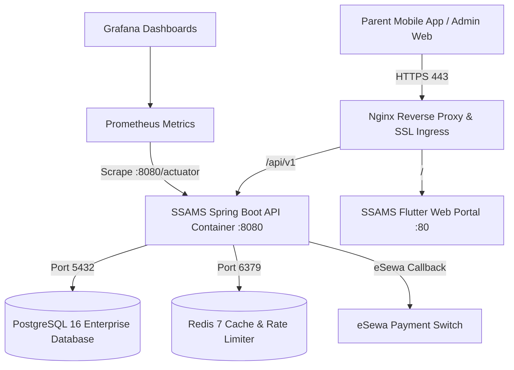

# Shree Susanskrit Secondary School
## Commercial Deployment, School Board Pitch & Operational Handover Manual

**Document Version:** 1.0.0 (Production Release)  
**Target Institution:** Shree Susanskrit Secondary School (`SHREE_SUSANSKRIT`), Kathmandu, Nepal  
**System:** SSAMS (Smart School & Academic Management System) / ARTMS  
**Prepared by:** Ozeonix Technologies

---

## 1. Executive Commercial Pitch & Value Proposition

### 1.1 The Challenge in Modern Nepalese School Administration
Traditional school management in Nepal suffers from:
1. **Fee Collection Leakages & Delays:** Paper fee cards and manual cash counters lead to uncollected dues, cash mishandling, long queues during exam time, and delayed reconciliations.
2. **Cumbersome Examination & Marksheet Processing:** Compiling CDC Nepal Grade 10 and NEB +2 marks with 75% Theory / 25% Practical splits into 4.0 GPA report cards requires weeks of manual spreadsheet calculations prone to human error.
3. **Disjointed Communication:** Parents only learn about absences, low grades, or overdue fees at the end of the term.
4. **Data Vulnerability:** Physical registers are vulnerable to fire, theft, and loss without automated disaster recovery.

### 1.2 The SSAMS Solution for Shree Susanskrit Secondary School
SSAMS provides an end-to-end, enterprise-grade academic and financial operating system tailored specifically for Nepalese institutions:

| Feature Pillar | Benefit for Shree Susanskrit Secondary School |
|---|---|
| **eSewa Digital Wallet Integration** | Parents pay tuition and examination fees 24/7 directly from their mobile phones. Instant zero-trust cryptographic verification (HMAC-SHA256) updates the student ledger in real-time. |
| **Nepal CDC & NEB 4.0 GPA Engine** | Fully automated calculation of Theory (75%) and Practical (25%) marks, conversion to Letter Grades (A+ to NG), and generation of tamper-evident report cards with verification QR codes. |
| **Bikram Sambat (BS) Calendar Native** | Academic terms, fee due dates, attendance, and exam routines run natively on the Nepalese calendar (Baisakh to Chaitra). |
| **Role-Based Security & Audit Trail** | Granular RBAC ensuring teachers only grade their assigned subjects, accountants manage money without modifying grades, and administrators retain complete oversight via append-only audit logs. |
| **Cross-Platform Experience** | Flutter web portal for administrative and accounting staff; native Android/iOS mobile application for students and parents. |

### 1.3 Financial Impact & Return on Investment (ROI)
- **90% Reduction in Fee Processing Overhead:** Replaces manual fee card punching with instant automated invoices and receipts.
- **100% Elimination of Grading Calculation Errors:** Marks calculated dynamically to 2 decimal places with NEB-mandated rounding.
- **Estimated Annual Cost Savings:** Over NPR 350,000 saved annually on paper registers, marksheet printing, lost receipts, and administrative man-hours.

---

## 2. Infrastructure Architecture & Hardware Specifications

### 2.1 Recommended Server Specifications (Cloud VPS or On-Premise)

| Parameter | Minimum Requirement (Up to 1,500 Students) | Recommended Production (Up to 5,000 Students) |
|---|---|---|
| **Operating System** | Ubuntu 22.04 / 24.04 LTS x86_64 | Ubuntu 24.04 LTS x86_64 |
| **CPU** | 4 Cores (2.4 GHz+) | 8 Cores (3.0 GHz+) |
| **RAM** | 8 GB ECC RAM | 16 GB ECC RAM |
| **Disk** | 80 GB NVMe SSD | 200 GB NVMe SSD (RAID-1 / ZFS) |
| **Network** | 50 Mbps dedicated uplink, Static Public IP | 100 Mbps uplink, Static Public IP |
| **Backup Storage** | 100 GB Off-site S3 / MinIO storage | 500 GB S3 bucket with versioning & MFA delete |

### 2.2 Container Topology



---

## 3. Production Deployment Guide

### 3.1 Step 1: Environment Configuration (`.env.production`)
Create `/home/ozeonix/ssams-prod/.env.production` with secure keys:

```bash
# Database Configuration
POSTGRES_DB=ssams_prod
POSTGRES_USER=ssams_prod_user
POSTGRES_PASSWORD=SECURE_RANDOM_POSTGRES_PASSWORD_HERE
DATABASE_URL=jdbc:postgresql://postgres:5432/ssams_prod

# Authentication & JWT
JWT_SECRET=BASE64_256BIT_SECRET_KEY_FOR_SSAMS_TOKEN_SIGNING_GOES_HERE
JWT_ACCESS_EXPIRATION_MINUTES=60
JWT_REFRESH_EXPIRATION_DAYS=30

# eSewa Payment Gateway (Production Merchant Credentials)
ESEWA_ENVIRONMENT=PRODUCTION
ESEWA_SERVICE_URL=https://epay.esewa.com.np/api/epay/main/v2/form
ESEWA_VERIFY_URL=https://epay.esewa.com.np/api/epay/transaction/status/
ESEWA_MERCHANT_ID=SHREE_SUSANSKRIT_PRODUCTION_MERCHANT_ID
ESEWA_SECRET_KEY=SECURE_PRODUCTION_HMAC_SECRET_KEY_FROM_ESEWA

# Redis & Application
REDIS_HOST=redis
REDIS_PORT=6379
SERVER_PORT=8080
LOG_LEVEL=INFO
```

### 3.2 Step 2: Initialize Database & Run Seed
Apply Flyway migrations and load the official Shree Susanskrit Secondary School dataset:

```bash
# 1. Start database container
docker compose -f infrastructure/docker/docker-compose.prod.yml up -d postgres redis

# 2. Verify PostgreSQL is healthy
docker compose -f infrastructure/docker/docker-compose.prod.yml exec postgres pg_isready -U ssams_prod_user

# 3. Apply the production seed for Shree Susanskrit Secondary School
docker compose -f infrastructure/docker/docker-compose.prod.yml exec -T postgres \
  psql -U ssams_prod_user -d ssams_prod < database/seeds/susanskrit_secondary_school_seed.sql
```

### 3.3 Step 3: Launch Services & SSL Setup
Configure Nginx with Certbot Let's Encrypt for automatic HTTPS:

```bash
# Install Certbot
sudo apt update && sudo apt install -y certbot python3-certbot-nginx

# Issue certificate for school domain
sudo certbot --nginx -d susanskrit.edu.np -d api.susanskrit.edu.np -d admin.susanskrit.edu.np

# Start all application containers
docker compose -f infrastructure/docker/docker-compose.prod.yml up -d
```

### 3.4 Step 4: Automated Daily Backup Cron
Configure automated daily backup at 02:00 AM Nepal Standard Time:

```bash
# Add to crontab via 'crontab -e'
0 2 * * * /home/bhola-dev58/Ozeonix/ssams/infrastructure/scripts/backup_database.sh >> /var/log/ssams_backup.log 2>&1
```

---

## 4. Role-Based Operational Handover Manual

### 4.1 For the School Principal / Headmaster
**Default Login:** `admin.susanskrit`  
**Core Responsibilities:**
1. **Executive Dashboard:** Access real-time student count, gender ratio, daily attendance percentages, and monthly fee recovery statistics.
2. **Academic Year & Term Activation:** Open new academic sessions and publish official term dates.
3. **Report Card Final Approval:** Review overall class distributions before approving the final release of marksheet PDFs to parents.
4. **Audit Trail Review:** Inspect `audit_log` records to verify who approved fee waivers, modified examination marks, or changed user permissions.

### 4.2 For the Head Accountant & Finance Office
**Default Login:** `accountant.susanskrit`  
**Core Responsibilities:**
1. **Setting Annual Fee Structures:** Define amounts for Tuition, Examination, Science Lab, Computer Lab, and Transport per grade.
2. **Bulk Invoice Generation:** At the beginning of each Nepali month (e.g. 1st of Baisakh), trigger bulk invoice generation for all active class groups with one click.
3. **Cash / Cheque Counter Payment:** For walk-in parents paying cash, record partial or full payment against the invoice number. The system instantly generates an official numbered receipt (`RCT-2083-XXXX`).
4. **eSewa Reconciliation:** Access the **Payments** screen in the Admin Portal to view live digital transactions, verify transaction UUIDs, and download bank settlement spreadsheets.
5. **Fee Defaulter Tracking:** Filter students by outstanding balance and dispatch automated SMS/Push reminders to parents.

### 4.3 For the Examination Controller & Committee
**Default Login:** `exam.susanskrit`  
**Core Responsibilities:**
1. **Exam Configuration:** Set up First Term, Second Term, and Annual Examinations, assigning full marks and pass marks.
2. **Component Marks Assignment:** Ensure subjects are configured with appropriate splits:
   - Compulsory English / Nepali / Science: Theory (75 marks, Pass 27) + Practical (25 marks, Pass 10).
   - Compulsory Mathematics: Theory (100 marks, Pass 35).
   - Computer Science: Theory (50 marks, Pass 18) + Practical (50 marks, Pass 20).
3. **Marks Entry Verification:** Track completion status across all subject teachers. Lock marks once submitted to prevent unauthorized tampering.
4. **Marksheet Generation:** Print batch marksheets formatted according to the CDC Nepal 4.0 grading system with institutional seal and QR code verification.

### 4.4 For Class Teachers & Subject Faculty
**Default Login:** `teacher.grade10` (or assigned email)  
**Core Responsibilities:**
1. **Daily Attendance:** Take class attendance every morning using the teacher mobile app or web portal in under 60 seconds.
2. **Internal & Terminal Marks Entry:** Enter student marks by roll number. The system automatically validates that marks do not exceed component full marks.
3. **Student Conduct & Remarks:** Add personalized evaluation comments on student performance for inclusion in terminal report cards.

### 4.5 For Students & Parents
**Default Login:** `student.aarav` (or Student Admission No / Parent Mobile OTP)  
**Core Features:**
1. **Class Timetable & Daily Attendance:** Check daily attendance status, tardiness, and school calendar notices.
2. **Terminal Marksheets:** View subject grades, GPA, teacher remarks, and download certified digital PDF report cards.
3. **One-Click eSewa Fee Payment:**
   - Tap **Pay Fees** on the mobile home screen.
   - Review pending monthly or terminal invoice breakdown.
   - Click **Pay with eSewa** — automatically opens eSewa app or web interface.
   - Enter MPIN and confirm payment.
   - Receive immediate confirmation, updated zero-balance ledger, and official digital receipt.

---

## 5. Pre-Deployment & Go-Live Checklist

| # | Check Item | Verification Method | Status |
|---|---|---|---|
| 1 | Production Server & Firewall configured (Ports 80, 443 open; 5432, 6379 closed to public) | `sudo ufw status` | [ ] |
| 2 | SSL/TLS Let's Encrypt certificates active and auto-renewing | `certbot certificates` | [ ] |
| 3 | PostgreSQL database initialized with Flyway migrations V1–V8 | Flyway schema history check | [ ] |
| 4 | Shree Susanskrit Secondary School seed dataset loaded | `SELECT count(*) FROM student WHERE tenant_id = 'e1000000-0000-0000-0000-000000000001'` | [ ] |
| 5 | eSewa Production Merchant ID and Secret Key loaded into Vault / Environment | HMAC signature verification test | [ ] |
| 6 | Student & Guardian records imported via `students_onboarding_template.csv` | Total count matches physical school register | [ ] |
| 7 | Staff accounts created and roles assigned via `staff_onboarding_template.csv` | Login test for Principal, Accountant, Teachers | [ ] |
| 8 | Class groups and sections (Grades 1–10 A & B, +2 Science & Management) verified | Academic configuration audit | [ ] |
| 9 | Grade 10 CDC Subject Components (75% TH / 25% PR) verified | Marksheet calculation test | [ ] |
| 10 | Baisakh 2083 Fee Structures configured for all grades | Finance committee sign-off | [ ] |
| 11 | Initial Baisakh invoices generated and sample payment tested | eSewa test transaction verified | [ ] |
| 12 | Automated daily database backup cron verified | Backup dump generated in `/var/backups/ssams` | [ ] |
| 13 | Off-site S3 backup replication script executed successfully | S3 bucket object listing check | [ ] |
| 14 | Disaster recovery restore drill completed | Clean restore to staging database | [ ] |
| 15 | Prometheus metrics and Grafana alerts functional | Alertmanager test notification received | [ ] |
| 16 | Principal and Administration staff training completed | Handover sign-off | [ ] |
| 17 | Accounting staff trained on counter receipting and eSewa reconciliation | Finance office sign-off | [ ] |
| 18 | Teachers trained on mobile attendance and marks entry | Faculty meeting demonstration | [ ] |
| 19 | Welcome SMS and mobile app download link sent to parents | SMS gateway dispatch confirmation | [ ] |
| 20 | 24/7 Technical escalation and SLA support contract signed | Ozeonix Technologies Support Desk active | [ ] |

---

## 6. Support & Emergency Contacts

- **Technical Support Partner:** Ozeonix Technologies Pvt. Ltd.
- **Emergency Helpline:** +977-9800000000 / support@ozeonix.com
- **SLA Resolution Guarantee:** Critical Severity 1 Issues (System Down/Payment Failures): < 1 hour.
